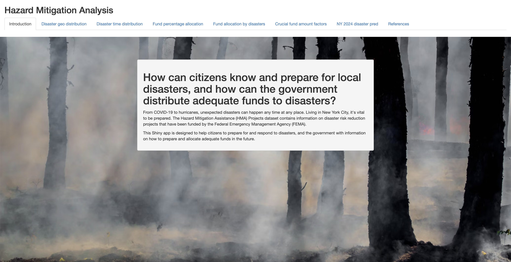

# Hazard Mitigation Analysis

A Shiny app exploring FEMA's Hazard Mitigation Assistance (HMA) data: where
and when disasters occur, how federal mitigation funds are allocated, and
what actually predicts the size of a federal award.



## Live demo

[https://drake-wang-2000.shinyapps.io/project2/](https://drake-wang-2000.shinyapps.io/project2/)


## Overview

The app has six tabs, backed by FEMA's public disaster and grant-funding
datasets:

1. **Disaster geo distribution** - heat map of mission-assignment locations
   by disaster type and year
2. **Disaster time distribution** - seasonal distribution of a selected
   disaster type
3. **Fund percentage allocation** - total federal share obligated by
   incident type
4. **Fund allocation by disasters** - share of requested project funds
   obligated, by state
5. **Crucial fund amount factors** - random forest feature importance for
   federal share obligated
6. **NY 2024 disaster pred** - historical extrapolation of incident-type
   mix for New York

## Data

- [OpenFEMA Hazard Mitigation Assistance Projects v3](https://www.fema.gov/openfema-data-page/hazard-mitigation-assistance-projects-v3)
- [OpenFEMA Disaster Declarations Summaries v2](https://www.fema.gov/openfema-data-page/disaster-declarations-summaries-v2)
- [OpenFEMA Mission Assignments v1](https://www.fema.gov/openfema-data-page/mission-assignments-v1)
- [OpenFEMA Public Assistance Funded Projects Details v1](https://www.fema.gov/openfema-data-page/public-assistance-funded-projects-details-v1)
- [US Census Bureau ZCTA Gazetteer file](https://www.census.gov/geographies/reference-files/time-series/geo/gazetteer-files.html) - ZIP-to-lat/long crosswalk used for geocoding

See [`data/README.md`](data/README.md) for how these are downloaded and
[`scripts/README.md`](scripts/README.md) for how they're turned into the
artifacts the app reads.

## Methods and findings

### Fund allocation vs. benefit-cost ratio

**Obligated %** = federal share obligated / requested project amount.
**Benefit-cost ratio (BCR)** = discounted annualized benefits / annualized
cost, reported by the applicant.

BCR is extremely right-skewed (a handful of projects report ratios in the
hundreds of thousands), so Pearson correlation is dominated by outliers:
Pearson r = 0.00. Spearman rank correlation, the more honest summary of
whether the two move together, is -0.078 (n = 27,827 projects) - a weak
*negative* relationship, not the positive one the original project
reported. In practice, obligated % and BCR are essentially unrelated.

### What predicts federal share obligated?

A random forest regresses `federalShareObligated` on five predictors:
program area, incident type, state, program fiscal year, and project
category (FEMA's leading eligible-activity code, collapsed from 312
free-text `projectType` values). Importance is permutation importance
(`randomForest`'s built-in `%IncMSE`, i.e. increase in out-of-bag MSE when
a predictor is shuffled) - not a hand-rolled shuffle-and-refit loop, which
is slower and produces unstable importance for high-cardinality factors.

| Feature | % increase in MSE |
|---|---|
| Project category | 5.85 |
| Program fiscal year | 4.42 |
| Incident type | 3.92 |
| State | 3.23 |
| Program area | 0.00 |

Fit on 7,815 complete rows with `programFy >= 2013`. Program area carries
no importance, most likely because HMA's three grant programs (HMGP, PDM,
FMA) don't differ enough in typical award size once the other four
predictors are known.

### New York 2024 incident-type mix

A random forest classifier trained on `(year, month) -> incidentType` from
55 historical New York disaster declarations, predicting class
probabilities for each month of 2024 and summing them into an expected
incident-type mix:

| Incident type | Expected months |
|---|---|
| Snowstorm | 3.25 |
| Hurricane | 3.04 |
| Winter Storm | 2.14 |
| Biological | 1.55 |
| Severe Storm | 1.41 |
| Flood | 0.57 |
| Severe Ice Storm | 0.03 |

With ~50 training rows across ~9 incident types, this is a low-sample
extrapolation from historical patterns, not a calibrated forecast - it's
presented as class probabilities rather than a single predicted label to
avoid implying more precision than the sample supports.

## Limitations

- The NY 2024 numbers are a historical extrapolation from 55 disaster
  declarations, not a forecast.
- Feature importance covers five predictors chosen for interpretability
  and randomForest's 53-level categorical limit; it shows association with
  award size, not causation.
- The fund-allocation correlation is weak in both directions, so it's
  reported as a descriptive finding, not evidence of a funding mechanism.

## Running it

```r
# 1. Download the raw FEMA/Census extracts (skip if data/raw/ is already populated)
Rscript scripts/01_download_data.R

# 2. Run the analysis pipeline: geocoding, summaries, and both random forests
Rscript scripts/00_run_all.R

# 3. Launch the app
shiny::runApp("app")
```

All random forests are fit with a fixed seed (see
[`lib/modeling.R`](lib/modeling.R)), so step 2 reproduces identical
`data/processed/*.csv` output byte-for-byte on every run.

## Repository structure

```
.
├── app/       Shiny app (ui + server); reads only precomputed artifacts
├── lib/       shared R functions used by scripts/ and app/
├── scripts/   numbered, run-in-order pipeline: raw data -> data/processed/ + models/
├── data/
│   ├── raw/       FEMA/Census extracts (gitignored, regenerated by scripts/01)
│   └── processed/ small derived CSVs the app reads
├── models/    cached random forest artifacts (.rds)
└── doc/       app screenshot
```

Each of `app/`, `lib/`, `scripts/`, and `data/` has its own README with
more detail.
